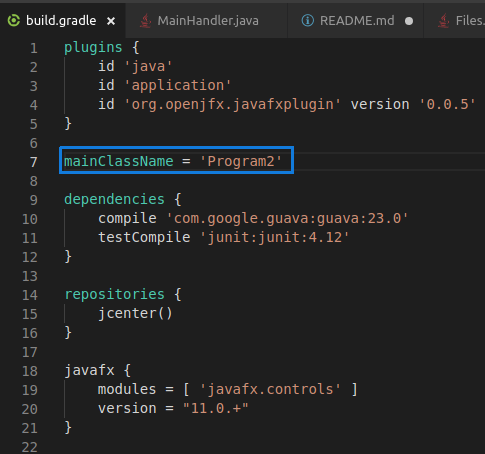
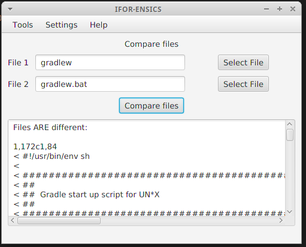
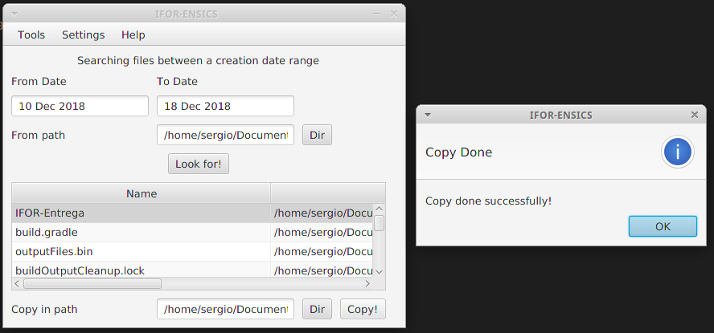
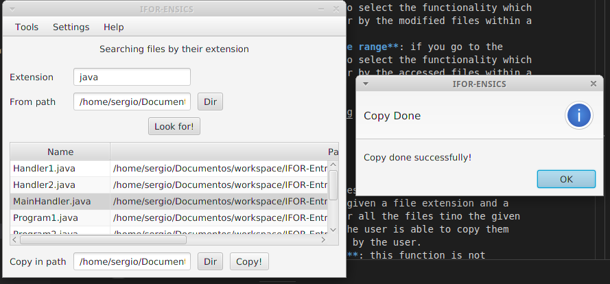

# IFOR-Entrega


Making a small GUI oriented to a little suite of forensics applications. With this applications you'll be able to see the diferences between files, directories.

## Table of Contents

1. [Objectives](#-objectives)
2. [Tools used in the project](#-tools-used-in-the-project)
3. [Run the software](#-running-the-software)
4. [Program 1](#-program-1)
5. [Program 2](#-program-2)
6. [Program 3](#-program-3)

### Objectives
---
The main goal of this repository is to bring some software build from scratch to the forensics field into the software development. The software shown in this repository is extremly simple but could be a proof of concept or a seed to make bigger projects if the community wants to. 

### Tools used in the project
---

Main tools used are:

- **Visual Studio Code**: main IDE to develop the software. Very usefull due to the integration with SCV tools as git and all the usefull plugins. You can obtain more information here [VSCode](https://code.visualstudio.com/)
- **Gradle**: for build the project and make all the folders and settings to the project. Combined with intellij for download dependencies, it is so powerful. You can get more information at [Gradle](https://gradle.org/)
- **Github**: to have a control version and share knowledge with rest of the world. You can find more software projects in my Github account. 
- **JavaFX**: the future of graphics in Java, it combine the power of CSS and the simplicity of awt to make bright and colourful gui's. See [JavaFX documentation](https://www.oracle.com/technetwork/java/javafx/documentation/index.html) to get more information. 

### Running the software
---

There is only one condition required to run this software. You must have installed [JDK 11](https://www.oracle.com/technetwork/java/javase/downloads/jdk11-downloads-5066655.html). Be sure that your enviromental variable for java is poiting to the JDK 11 distribution, if not, the software will not run. 

In theory you don't need gradle, because the gradle wrapper makes all the work. In case the gradle wrapper fails in the execution, you must install gradle in your computer and, as told before, make sure the envormental variable for gradle is poiting to the last version. For this software you need [Gradle 4.10.2](https://gradle.org/next-steps/?version=4.10.2&format=all). 

To run this software, you have to specify in the [build.gradle](build.gradle) file the Program to run. You must change there the variable mainClassName. The values accepted are:

- ```mainClassName = 'Program1' ```: to run the program related to search diferences.

- ```mainClassName = 'Program2' ```: to run the program related to search files between date ranges. 

- ```mainClassName = 'Program3' ```: to run the program related to searach files by the extension or magic numbers. 



### Program 1
---

This program has two diferent functionalities:
- **Search for differences between two files**: given two files, selected with the known path or the gui, the program search for differences in these files and show them in the text area of the program. 
- **Search for differences between two directories**: given two directories, selected writing the path or with the gui, the program search for differences in these directories and show you the files that are different.



In the two cases, if the program doesn't find any diferences, show a message lie No differences were found. You can select which version of the program you want to run by clicking in Tools menus in the upper bar. 

### Program 2
---

This program has three diferent functionalities:
- **Search for created files between a date range**: given a date range in the format "10 Dec 2018", without quotes. Also able to parse dates like "10 December 2018", "10 dec 2018" or "10-12-2018" or "2018/12/12". Also you need to select the folder you want to look for and then click in Look for! button. The the software shows you the results in a table. In this table you are able to select some files and copy them into a given directory previously selected, once the file was copy is removeed from the table and the software shwos you a dialog.
- **Search for modified files between a date range**: if you go to the Tools menu in the upper bar, your're able to select the functionality which you have to run. This allows you to look for by the modified files within a date range into a folder. 
- **Search for accessed files between a date range**: if you go to the Tools menu in the upper bar, your're able to select the functionality which you have to run. This allows you to look for by the accessed files within a date range into a folder. 




### Program 3
---

This program has two diferent functionalities:
- **Search files filtering by extension**: given a file extension and a root directory, the user is abel to look for all the files tino the given directory. Once the files are found, then the user is able to copy them into a diferent folder, previously selected by the user. 
- **Search files filtering by magic numbers**: this function is not implemented yet. But basically the user should be able to look for files by some magic unmbers provided by an external program. 

